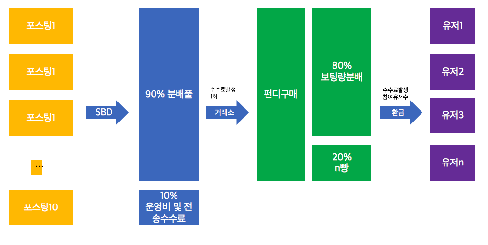

# Steemit PundiX funding

이 문서는 kr-funfun방에서 제안이 나온, Steemit 포스팅 보팅을 통한 PundiX funding 프로젝트 코드를 위해 만들어졌습니다.
개발 Roadmap은 다음과 같습니다.

## 개괄도

## 개발 로드맵

### 1. 계산 간편화
각 펀딩 포스팅에 접속하여 보팅 현황을 긁어오고 개괄도에 있는 분배대로 계산해주는 모듈을 작성합니다.
### 2. 서버화
현재 편딩과 개인 현황을 알 수 있는 Endpoint를 만들어 서버화 합니다.
개발 지식이 있으면 누구나 볼 수 있습니다.
### 3. 웹서비스화
프론트앤드도 작성하여 개발지식이 없는 분도 누구나 현황을 볼 수 있게 합니다.
### 4. 출금자동화(미정)
자금을 MEW로 모은다면, 환급 신청도 자동화할 수 있는 단계를 만듭니다.
